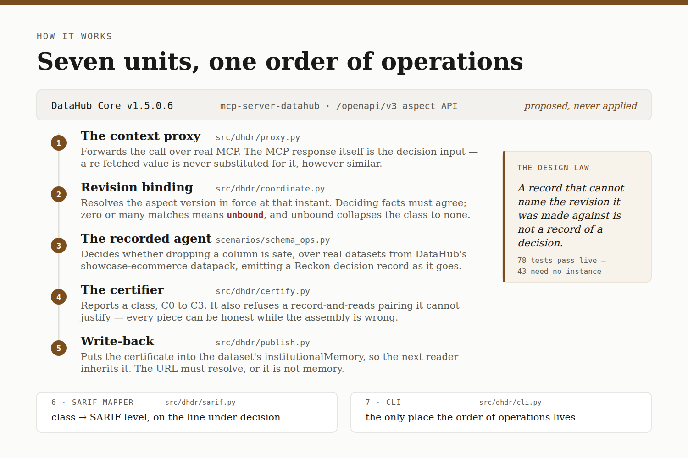

# dhdr — decision records for DataHub agents

**In plain terms, before any jargon.**

A company's data lives in thousands of tables. Some of those tables feed dashboards that people
make decisions from. An engineer wants to delete a column from one of them, and needs to know
first: is anything still using it?

An AI agent can answer that. It looks up what depends on the table, finds nothing, and says the
deletion is safe. It writes down its reasoning. So far so good.

Three weeks later a dashboard is broken. Someone asks why the agent allowed it. They open the
note the agent wrote. It says *"nothing was using it."*

But that answer changes over time. Something may have started using the table an hour before the
agent looked. Or an hour after. **The note does not say which version of the world it describes.**
So nobody can tell whether the agent was wrong, or right about a world that had already changed.

This project fixes that. Every time the agent looks something up, we record *which version* of the
company's records it saw — not only what it saw. The note now reads "nothing was using it,
according to version 461, recorded at 22:24:56". The question is answerable.

And when we cannot establish which version the agent saw, we say so. We refuse to vouch for the
decision rather than issue an approval that looks clean.

The demo shows one agent making the same request twice, seconds apart. Someone changes a data
pipeline in between. The agent reaches opposite conclusions. The two notes look identical. Only
our record can tell you which world each was made in.

---

**The same thing, for a data engineer.** An agent that makes schema and access decisions
from DataHub context — lineage, ownership, glossary terms — and can prove **which version of that
context justified each decision**.

Reading metadata to decide something is the easy half. The hard half arrives later, when someone
asks why the agent allowed a column drop that broke a dashboard. The lineage has moved since. The
log says "no consumers found". Nothing in it says whether that was true at the time, or only true
of a stale read.

`dhdr` closes that gap. Every context read is bound to the metadata revision that was in force
when the read happened. A decision whose reads cannot be bound is reported as certifying nothing,
not as passing.

Built for **Build with DataHub — The Agent Hackathon**, track *Agents That Do Real Work*.

**Walkthrough with real output: https://laolex.github.io/datahub-decision-records/** — every
block on that page was produced by the code here, against a live DataHub Core instance.

> **Status.** The capture core, revision binding, both agents, the certifier, write-back and the
> demo CLI are built and tested against a live DataHub Core v1.5.0.6 instance. Everything in
> `examples/` was produced by running them. Nothing here claims a result it has not produced.

## Try it

**Read the outputs, no setup** — [`examples/`](examples/) holds real artifacts from a real run,
and the [hosted walkthrough](https://laolex.github.io/datahub-decision-records/) shows the same
with commentary. Its certificate links resolve.

**Run the logic, no DataHub, about a minute:**

```bash
git clone https://github.com/Laolex/datahub-decision-records && cd datahub-decision-records
pip install -e '.[dev]'
pytest -q          # 43 pass with no instance; the rest skip by marker, not by failing
```

**The whole thing against a live DataHub** — `python scripts/quickstart.py`, one command from a
running instance to a certified decision. Setup detail is in [Running it](#running-it) below.

## The design law

*A record that cannot name the revision it was made against is not a record of a decision.*

And its companion, which is why this ships as something a team installs rather than a demo:

*A record nobody keeps certifies nothing. Soundness that is not installed is not soundness.*

## How it works



Seven units, each independently testable: five that make a decision certifiable, then two that
put the certificate where someone will act on it.

**The context proxy** (`src/dhdr/proxy.py`) sits between the agent and DataHub's MCP server.
It forwards every tool call over real MCP transport and returns *the MCP response itself* to
the agent — that response, and nothing else, is the decision input. A re-fetched value is
never substituted for it, however similar; between two fetches the metadata may have moved,
and then the revision on the record is not the revision that decided.

**Revision binding** (`src/dhdr/coordinate.py`) resolves the aspect version in force at the
instant the response was received, via `GET /openapi/v3/entity/{type}/{urn}/{aspect}?version=N`
and `systemMetadata.lastObserved`. Proximity in time only *proposes* a candidate. The deciding
facts extracted from the MCP response and from the aspect must then agree before a binding is
made. Zero matches means a write landed between the agent's read and ours; more than one means
the facts do not discriminate. Both are **unbound**, and an unbound deciding read collapses the
capability class to none — never "C2, but one read is unbound", which is exactly the phrasing a
hurried reader takes as certification.

**The change artifact.** A verdict nobody can act on is not much use. So each decision carries the
concrete change it is about. When the drop is allowed, that is `ALTER TABLE … DROP COLUMN
promo_code;`. When it is refused, it is a deprecation comment naming the consumer that still reads
the column. A refusal that proposes the safe alternative is the part that does real work.

The artifact is **proposed and never applied**. `dhdr` decides and records. It does not run
migrations, and there is deliberately no code here that would. The record commits to the artifact
by `params_digest`, so the certificate names which change it certified without carrying a copy
that could drift from it.

**The recorded agent** (`scenarios/schema_ops.py`) decides whether dropping a column is safe,
over real datasets from DataHub's `showcase-ecommerce` datapack, emitting a
[Reckon](https://pypi.org/project/reckon-rcdr/) decision record as it goes. It reads the same
lineage either through MCP or through the aspect API and records the decision identically, so
the scenario is not written twice and cannot drift between the two.

**The certifier** (`src/dhdr/certify.py`) reports a capability class — C0 identity, C1 tightening, C2
loosening, C3 state-coupled — never a percentage. A score over incommensurable kinds of
missing evidence manufactures false confidence. C3 is certified as a *boundary*: where a
decision mutates metadata a later decision reads, the certificate states where deductive
evidence ends and counterfactual inference begins, and claims nothing past that line.

It also refuses a pairing it cannot justify. `certify` receives the record and the captured reads
as separate arguments. Nothing about the call obliges them to describe the same decision. Every
individual piece can be honest while the assembly is wrong, and the result is a clean-looking
certificate over a decision that never happened.

So the record's revision must match a revision that some supplied read actually bound to. If it
does not, the class collapses to none. The check needs no extra capture, because the record
already names the revision it was decided against.

**Write-back** (`src/dhdr/publish.py`) puts the certificate into the dataset's
`institutionalMemory`, so the next agent or engineer inherits what was decided, against which
revision, and how far the evidence went — without rerunning anything. The description is a
summary; the URL is the artifact, and it must be resolvable HTTPS, because institutional memory
a later human cannot open is not memory. The agent's own write is itself state a later decision
may read, so it is surfaced as a C3 boundary — derived from a recorded publish event, never from
a flag the caller passed.

One limitation, stated plainly. The write is **not atomic**.

On DataHub Core v1.5.0.6 neither available mechanism works for this aspect. `If-Version-Match` is
documented as an optimistic-concurrency precondition, but the write endpoint does not enforce it —
a stale-version write returns 200 and overwrites. And server-side JSON patch has no template
registered for `institutionalMemory`, though it does for `globalTags` and `upstreamLineage`.

So this module does read-append-write with a verified read-back. It carries forward every element
it saw, and retries if its own element did not land. That preserves anything written before it
read, and detects being overwritten. It does **not** close the race where another writer lands
between our read and our write. Both platform facts are pinned by tests that fail if either
mechanism starts working.

**The SARIF mapper** (`src/dhdr/sarif.py`) turns a certificate into the format code scanning
already understands, so a decision lands as an annotation on the line of SQL that caused it
rather than in a terminal somebody ran once. SARIF is the right carrier because its `level` is
ordinal — note, warning, error — so the capability classes map onto it directly and nobody has
to invent a number: C0 and C1 are `note`, C2 `warning`, C3 `error`. A record that certifies
nothing gets its own rule, at `warning` by default so a gap in instrumentation does not read as
a code defect, and at `error` under `--strict` once a team has earned confidence in coverage.
The annotation is placed on the line under decision, because a code host renders a result inline
only when it falls on a line the diff touches.

**The CLI** (`src/dhdr/cli.py`, the `dhdr` command) is the only place the *order* lives: it wires
a scenario to the proxy, runs it, certifies the result, writes the certificate back and emits the
SARIF. Everything above it is a library that can be called without it, and their own dependencies
run one way and never cycle — `proxy` on `coordinate`, `certify` on `proxy`, `publish` and
`sarif` on `certify`. Nothing imports the CLI. That is why it is the largest file here:
sequencing is its whole job, and keeping it in one place is what stops the units from having to
know about each other.

The capture core is domain-ignorant by construction. It knows about reads, versions,
predicates and candidate sets. It does not know what a schema, an owner or a pipeline is. If a
scenario requires a change to the core, the core is wrong.

**A second scenario tests that claim rather than asserting it.**
`scenarios/access.py` decides whether to grant access to a dataset, flipping when a PII
glossary term is applied — a different aspect, a different predicate, a different question. It
required no change to `proxy.py` or `certify.py`, and the knowledge of which glossary terms
restrict access lives in the scenario, because the core takes an extractor as an argument
precisely so it never has to hold any.

It did force one change, and that is why a second domain was worth building. `read_aspect` was
reading through the openapi **v2** endpoint. That endpoint returns 400 for `glossaryTerms`,
`institutionalMemory` and `status` on Core v1.5.0.6, because it fails to deserialise its own
`SystemMetadata`. It handles `upstreamLineage` fine.

So a lineage-only test suite reports a healthy coordinate layer that cannot read three aspects at
all. `history()` comes back empty, every read binds to nothing, and nothing raises. It is now a v3
read, with a regression test that exercises a non-lineage aspect.

## What a record contains

The record is the product, so here is every field it carries. Format and hash chaining come from
[`reckon-rcdr`](https://pypi.org/project/reckon-rcdr/); what goes in them is this project's
argument. A live example is [`examples/record-then.json`](examples/record-then.json).

The last column is measured, not asserted: it is what
[`examples/ablation.txt`](examples/ablation.txt) reports when that field is deleted from an
otherwise complete record and the certifier is re-run. Fields the ablation does not cover are
marked `—`; that means untested, not unimportant.

| field | holds | deleting it costs |
|---|---|---|
| `outcome` | what was decided — `admit` or `reject`. | — |
| `predicate.id` `.expression` `.operator` | the rule that decided, as an id, a readable form and its comparison operator. | C2 → **C0** |
| `compared.value` `.type` | the value the predicate was evaluated against, and its type. | — |
| `policy.key` `.resolved_value` | which policy applied and the value it resolved to. | C2 → **C0** |
| `policy.resolution.source` | the DataHub URN and aspect the policy was resolved from, revision-qualified. | — |
| `policy.resolution.revision` | the aspect version in force when the deciding read happened. | C2 → **C2** — see below |
| `policy.resolution.provenance` | where the policy came from — `bundled` here, so a reader can tell configuration from default. | — |
| `candidates.items` | every action considered, each with its predicate, compared value and outcome. This is what makes the C1 and C2 counterfactuals answerable. | — |
| `candidates.completeness` | whether that set was `exhaustive` or partial. A counterfactual over a set that might be missing an option is not an answer. | C2 → **C1** |
| `reads[].source` | the URN, aspect and bound revision of each deciding read — `…#upstreamlineage@v935`. | unbound read → **none** |
| `reads[].value_digest` | a digest of the value the agent actually received, so a substituted value is detectable. | — |
| `reads[].key` | which predicate input this read supplied. | — |
| `writes` | metadata this decision mutated. Non-empty is what raises the C3 boundary. | — |
| `action.id` `.params_digest` | the change being decided about, committed to by digest so the certificate names which change it certified without carrying a copy that can drift. | — |
| `execution.pure` | whether the decision function was pure. | C2 → **none** |
| `execution.runtime` `.clock` `.seed` `.deps_digest` `.path_digest` | the execution fingerprint: interpreter, any clock or seed read, and digests of dependencies and code path. `null` for clock and seed is a recorded absence, not a missing field. | — |
| `decision_id` `run_id` `sequence` `ts` | identity and ordering within a run. | — |
| `capture.emitter` `.sdk_version` `rcdr_version` | what wrote the record and in which format version. | — |

Two rows deserve reading twice.

**`execution.pure` is the most load-bearing field in the record**, and it is not the one this
project is about. Remove it and nothing is certifiable at all: an impure decision function could
have consulted anything, so no replay proves anything, whatever else was captured.

**`policy.resolution.revision` costs nothing to delete.** The class stays C2. That result goes
against the design law printed at the top of this README, and it is published rather than
buried: what actually carries the soundness is `reads[].source` — the *binding*, and the refusal
to certify when a read has none. The revision on the record is the human-readable name for a
fact the binding already established. See [Ablation](#ablation).

## Scenarios

Two, both deciding over real `showcase-ecommerce` entities:

| scenario | reads | flips when |
|---|---|---|
| `scenarios/schema_ops.py` — is dropping this column safe? | `upstreamLineage` | a pipeline wires a consumer to the table |
| `scenarios/access.py` — should this access request be granted? | `glossaryTerms` | a PII term is applied to the dataset |

A third was designed — incident triage over data-quality assertions — and is deliberately **not**
built. It needs `get_dataset_assertions`, which is not reachable on DataHub Core: the OSS server
registers eight tools and that is not among them, because the tool sits behind
`DATA_QUALITY_TOOLS_ENABLED` (default off) *and* a DataHub Cloud version gate. Building it anyway
would have meant reading assertions by a route the agent surface does not offer — the opposite of
this project's argument.

## How we know it is right

Most of this suite was written by the same person who wrote the code, from the same mental
model. That is worth saying plainly, because it bounds what the tests prove: if the model of
"which revision was in force at instant T" were wrong, the tests would encode the same wrong
model and pass. A suite that only checks itself is not evidence of correctness — which is this
project's own thesis, turned on itself.

So two things check it from outside.

### A differential oracle against DataHub's own storage

`tests/test_oracle.py` does not ask `dhdr` for the answer. It queries `metadata_aspect_v2` — the
MySQL table DataHub actually stores aspects in — and requires our answer to match, at every
revision boundary, the millisecond either side of it, and midway between revisions.

**It found a real defect.** DataHub's `systemMetadata.lastObserved` records when metadata was
last *observed*, not when a revision took effect, and a no-op write refreshes it without creating
a revision. One case diverged from the row's actual write time by nine hours. `resolve_at` orders
by `lastObserved`, so it can propose the wrong revision — and at one probed instant it did, naming
a revision with one upstream where storage said zero.

**The architecture contained it.** `bind_revision`, which is what the agent actually calls,
compares the deciding facts before binding and *refused*. The wrong proposal became an honest
"unbound" rather than a false certificate. That safety net was built for a different reason — the
race where metadata moves between the agent's read and the resolver's — and it caught this too.

So the property the oracle asserts is not "the proposal is always right", which is false and
demonstrably so. It is the weaker, load-bearing one: **the agent never binds to a revision
DataHub's storage contradicts.** That holds across every instant probed.

### Properties over generated inputs

`tests/test_properties.py` uses Hypothesis to generate inputs rather than check the examples the
author happened to think of — which is exactly where an author's blind spot lives.

It found a second defect: with an unbound read and no bound ones, the certificate refused
correctly but gave the *wrong reason*, reporting "not from the same decision" when the truth was
"the read could not be dated". Both refuse; only one is honest, and on a project about not
manufacturing false impressions that distinction is not cosmetic. The check order now puts
unbound first.

### What this does and does not establish

| claim | evidence |
|---|---|
| The agent never binds to a revision storage contradicts | **Verified externally**, against MySQL, at 83 instants |
| An unbound read always collapses the class | **Property-tested** over generated mixes, not chosen examples |
| Both payload shapes yield identical facts | **Property-tested** — the invariant the two-path design rests on |
| A refusal never proposes destructive DDL | **Property-tested** |
| `resolve_at` alone is always correct | **False, and known false.** See above; contained by fact-matching |
| The suite can detect wrongness in general | **Not established.** Mutation testing is not yet running — mutmut's sandbox conflicts with this repo's test layout |
| Behaviour under a real concurrent write | **Not established.** The race is asserted synthetically, never induced |

The last two are the honest gaps. They are specific rather than vague, which is the most useful
thing to be able to say about what you have not proved.

## Ablation

Remove one captured field at a time and see what the certifier can still claim. An entry that
cannot show which part of its own record is load-bearing has not demonstrated that the record is
necessary. Reproduce with `pytest tests/test_ablation.py -s`.

```
removed                        class still available
(none — full record)           C2
execution.pure                 none
predicate.id                   C0
policy.resolved_value          C0
candidates.completeness        C1
policy.resolution.revision     C2
read binding (unbound read)    none
```

The fifth row is the one worth reporting, and it does not favour us. **Deleting the revision from
the record costs nothing.** The underlying verifier has no concept of a DataHub aspect version. A
record carrying a revision and a record missing one certify identically. The revision in the
record is documentation for a later reader. It is not evidence.

What carries the weight is the last row — the binding. A read that could not be tied to a revision
collapses the class to none. So this project's contribution to soundness is the *refusal*. The
value is in declining to certify a decision whose world cannot be named. It is not in annotating a
record with a version string.

Both results are pinned by tests. If the upstream verifier ever starts checking the revision, this
section is what breaks.

## Why the coordinate has to be recovered

DataHub the platform maintains this coordinate already — versioned aspects keyed by version
number, the Timeline API over entity change history, `If-Version-Match` on
`/v3/entity/{entityName}/batchGet`. What the agent-facing read tools return does not carry it
through, so a read silently resolves to *now*. The evidence needed to bind a decision is
therefore already stored and one API away; this project binds it to the decision rather than
adding anything new to the platform.

That is the reason the provenance layer had to exist, not the pitch. The pitch is the agent.

### What changes if the version coordinate ships upstream

Worth stating plainly, because a thesis that depends on a gap staying open is a fragile one, and
[#181](https://github.com/acryldata/mcp-server-datahub/issues/181) is a request for that gap to
close.

**Almost all of this survives.** And the part that goes away is the part we would most like to
lose.

Suppose `get_lineage` grew an `as_of` parameter tomorrow, or simply echoed
`systemMetadata.version` in its response. Acquiring the coordinate would get simpler. The
fact-matching in `coordinate.py` exists only because the response cannot date itself; a read that
carries its own version needs no matching. That is a workaround retiring, which is what a
workaround is for.

Everything downstream of having the coordinate does not change. Binding it to the decision.
Refusing to certify when it cannot be bound. Reporting a capability class rather than a
percentage. Declaring the C3 boundary where the agent's own write couples it to future state.
Publishing the certificate where the next reader inherits it. None of that follows from the gap. It follows from the design law: *a record that cannot name the revision it was made against is not
a record of a decision.* That is true of any agent reading any versioned metadata — including one
whose platform hands it the version for free.

Two things get *easier* rather than harder in that world. The race this design has to guard
against — metadata moving between the agent's read and the resolver's — disappears, because the
coordinate arrives with the response instead of being recovered afterwards. And the honest
`unbound` outcome becomes rare rather than routine.

So the right reading if the parameter ships is **validation, not obsolescence**: the platform
agreed the coordinate belongs on the agent's surface. The workaround was always the cost of it not
being there yet, and the ablation already reports which half was load-bearing — the refusal, not
the annotation.

## As a CI gate, not only a CLI

A certificate printed by a CLI is read once, by the person who ran it. A certificate that arrives
as an annotation on a pull request is read by whoever is about to merge — the moment it can still
change something. That is the second design law in practice: *a record nobody keeps certifies
nothing.*

```bash
python -m dhdr.cli sarif --path pipelines/orders.sql > dhdr.sarif
```

**This is not a description of what would happen.** It runs on
[pull request #1](https://github.com/Laolex/datahub-decision-records/pull/1) of this repository,
where the certificate arrives as a code-scanning annotation on `pipelines/orders.sql`:

```
dhdr/decision-certified | pipelines/orders.sql | Capability class: C2
```

The workflow is [`.github/workflows/dhdr-gate.yml`](.github/workflows/dhdr-gate.yml), and it
states its own limit at the top: producing a certificate needs a live DataHub to read revisions
from, which a hosted runner has none of. With `DATAHUB_GMS_URL` configured it generates one in
CI; otherwise it uploads `examples/decision.sarif.json`, produced against a live DataHub Core
v1.5.0.6 and committed. Either way the annotation on that PR is a real certificate from a real
decision — what the fallback does not prove is that CI reached DataHub.

The output is SARIF 2.1.0 ([`examples/decision.sarif.json`](examples/decision.sarif.json)), which
any code host ingests. SARIF's `level` is ordinal — `none`, `note`, `warning`, `error` — so the
capability classes map onto it directly and nobody has to invent a percentage on the way:

| class | level |
|---|---|
| C0, C1 | `note` |
| C2 | `warning` |
| C3 | `error` |
| unsound (any unbound read) | `warning`, or `error` under `--strict` |

Note that last row. **Unsoundness fails open by default.** A gate that blocks a merge because of
a gap in its own instrumentation gets uninstalled inside a week, and an uninstalled gate
certifies nothing at all. `--strict` fails closed for teams that have decided they want that, and
only then does the command exit non-zero.

## Upstream

Two findings from this build were filed back, both reproducible on DataHub Core v1.5.0.6:

- [acryldata/mcp-server-datahub#181](https://github.com/acryldata/mcp-server-datahub/issues/181)
  — an optional point-in-time parameter for context reads. No read tool accepts a version or
  timestamp, and no shipped GraphQL selection requests `systemMetadata`, so a read resolves to
  *now* and the response carries nothing that dates it. The proposal defaults to current so
  nothing breaks, with a smaller fallback (echo the resolved version in responses) that needs no
  time travel at all. This is the gap the whole project works around.
- [datahub-project/datahub#18851](https://github.com/datahub-project/datahub/issues/18851), fixed by
  **[PR #18869](https://github.com/datahub-project/datahub/pull/18869)**
  — `institutionalMemory` has no registered patch template, so `PATCH` fails with a null-template
  `NullPointerException`. Eight other dataset aspects handle the same request, so it is a
  per-aspect gap. This is the reason write-back here is read-append-write rather than an atomic
  append — so rather than only report it, the PR adds `InstitutionalMemoryTemplate` following the
  existing `GlobalTagsTemplate` pattern, with a test for the two-writers case that motivated it.

## Running it

From a running DataHub instance to a certified decision, in one command:

```bash
pip install -e '.[dev]'
python scripts/quickstart.py
```

It checks the instance, ingests DataHub's `showcase-ecommerce` datasets if they are not already
there, verifies the one setting this depends on, and runs the demo. Safe to re-run.

**Starting DataHub is the one step it does not do for you** — that is `docker compose up` in
DataHub's own quickstart, and guessing at your compose file would be worse than asking. Copy
[`quickstart/docker-compose.override.yml`](quickstart/docker-compose.override.yml) next to it
first; it sets the one required setting and closes a security hole in the stock compose file
(every service, including an unauthenticated OpenSearch, is published on `0.0.0.0`).

The one required setting, if you would rather apply it by hand: **`CACHE_SEARCH_LINEAGE_TTL_SECONDS=0`**
on GMS. Its shipped default is a day, and MCP `get_lineage` reads through that cache. So a lineage change
reaches the graph index in seconds, then stays invisible to the agent for hours. The demonstration
times out rather than passing on stale context.

Expect the DataHub bring-up itself to dominate the wall clock on a cold machine; everything after
it is seconds.

## Running the tests

The integration tests **mutate lineage on the instance**, because demonstrating that a decision
flips requires the world to actually move. Two suites running against the same DataHub at once
will fight over that state and produce a spurious failure. One suite per instance.

Requires a live DataHub Core instance for the integration tests. `DATAHUB_GMS_URL` says where it
is — the same variable the DataHub SDK and MCP server read — and defaults to `localhost:8080`.
Every entry point honours it, and `dhdr --base-url` overrides it for one run.

```bash
pip install -e '.[dev]'
python scripts/preflight.py      # check the instance can demonstrate the flip
DATAHUB_GMS_URL=http://localhost:8080 python -m pytest -v
```

The integration tests skip unless DataHub both identifies itself *and* answers a search query.
A stack whose Elasticsearch/OpenSearch container is down still serves `/config` and still reports
its other containers healthy, so a check that trusted `/config` alone would un-skip the
integration tests against a half-working instance and fail in a way that looks like this project
is broken. It is not; the skip reason will say so.

The refusal has its own gate, which needs no DataHub and is the fastest way to see what the
project actually claims:

```bash
python scripts/negative_control.py    # exits non-zero if the refusal stops holding
```

Run the preflight first. A stock DataHub quickstart serves lineage from a cache whose default
TTL is a day, and `get_lineage` reads through it — so the world changes, the graph index updates
within seconds, and the agent keeps seeing the old answer. The only symptom is a test that times
out, which looks like a bug here and is not one. The preflight measures it directly and prints
the one setting to change.

See the two decisions for yourself:

```bash
python -m dhdr.cli demo     # live MCP reads, two decisions, both written back
python scripts/demo.py      # the same run, paced to be read (or --fast)
```

Both go through the real MCP server and publish each certificate into DataHub. There is no time
travel in that path: MCP only ever answers about *now*, so the world genuinely moves between the
two reads and the command waits for MCP itself to report the change. `--no-publish` decides and
certifies without writing back.

```
=== as the agent saw it ===
outcome:  admit
revision: v131  (lastObserved=1785837756441)
Capability class: C2

=== as it actually was ===
outcome:  reject
revision: v132  (lastObserved=1785837761548)
Capability class: C2

Same agent. Same call. Opposite decisions.
The log cannot tell you which world it was made in. The certificate can.
```

78 tests: 43 run with no DataHub at all, 35 need a live instance. The ones worth knowing about:

- the agent calls `get_lineage` through the real MCP server, decides `admit`, and then — after a
  pipeline change wires a consumer to the table — makes the identical call and decides `reject`,
  with the two records naming different revisions;
- an MCP read binds with `value_source == "mcp"`, proving the decision input was the protocol
  response rather than a re-fetch;
- a mismatched payload is left unbound rather than guessed;
- history survives DataHub's retention pruning the oldest aspect versions;
- a second scenario (access/governance, a different aspect) rides the same core unchanged.

Note that the flip test needs GMS's lineage cache disabled
(`CACHE_SEARCH_LINEAGE_TTL_SECONDS=0`). With the shipped default a lineage change reaches the
graph index in seconds but stays invisible to `get_lineage` for hours, and the test times out
rather than passing on stale context.

## Reproduce

Everything in [`examples/`](examples/) is a real artifact produced by this code, not a description
of one. Two decision records, their certificates, the demo transcript, the live MCP flip, the
ablation table, and what a later reader inherits from `institutionalMemory`. Regenerate all of it
with one command against a live instance:

```bash
python scripts/generate_examples.py
```

### The world

The live end-to-end run — two decisions, real MCP reads, certificates written back — was
performed against **DataHub Core v1.5.0.6**, `mcp-server-datahub` 0.6.0, `acryl-datahub` 1.6.0.17.
That is the combination the transcripts and published certificates in `examples/` came from.

The dependency floor in `pyproject.toml` is deliberately a floor, not a pin, so a fresh install
today resolves `acryl-datahub` 1.7.0 instead. The 33 no-DataHub tests and the negative control
pass on both. What has *not* been re-run end-to-end against 1.7.0 is the live MCP path, because
that needs an instance; if you have one and it behaves differently, that is worth an issue.

The scenario decides over real datasets from DataHub's own `showcase-ecommerce` datapack, not
invented URNs — MCP resolves upstreams that exist *as entities*, so a fabricated URN produces a
demo that silently binds to nothing. Two things to know first. `datahub datapack load showcase-ecommerce` does **not** fetch the real
pack — it writes about 54 bundled records and reports success. And the real pack contains DataHub
Cloud aspects that Core's GMS rejects with a 422. So fetch it directly and filter those out:

```bash
mkdir -p datapack && cd datapack
for f in 01-definitions 02-data 03-context; do
  curl -sL "https://raw.githubusercontent.com/datahub-project/static-assets/main/datapacks/showcase-ecommerce/$f.json" -o "$f.json"
done

python - <<'PY'
import json
CLOUD_ONLY = {"testResults", "lineageFeatures", "entityInferenceMetadata",
              "usageFeatures", "documentation"}
records = json.load(open("02-data.json"))
keep = [r for r in records
        if r.get("entityType") == "dataset" and r.get("aspectName") not in CLOUD_ONLY]
json.dump(keep, open("02-datasets.json", "w"))
print(f"dataset records kept: {len(keep)}")
PY

cat > recipe-ds.yml <<'YML'
source:
  type: file
  config:
    path: ./02-datasets.json
sink:
  type: datahub-rest
  config:
    server: http://localhost:8080
YML
datahub ingest -c recipe-ds.yml
```

### One required setting

GMS caches lineage search results with a shipped default TTL of a day, and MCP `get_lineage`
reads through that cache — so a lineage change reaches the graph index within seconds and stays
invisible to the agent for hours. The flip depends on the world moving between two reads, so set
`CACHE_SEARCH_LINEAGE_TTL_SECONDS=0` on GMS. With it off, MCP reflects a change in about three
seconds; with it on, the flip test times out rather than passing on stale context.

## Pre-existing work

Per the hackathon rules, what was not built during the submission window:

- **[`reckon-rcdr`](https://pypi.org/project/reckon-rcdr/) 0.1.1** — my own decision-record
  format and verifier, published before this event. It supplies the record schema and the
  capability classes (C0–C3). It knows nothing about DataHub. Everything that binds a record to
  a metadata revision is new here, and the [ablation](#ablation) reports honestly that the
  revision field is inert to the upstream verifier — the binding check in this repo is what
  carries the soundness.
- **`acryl-datahub` 1.6.0.17** and **`mcp-server-datahub` 0.6.0** — DataHub's own SDK and MCP
  server, unmodified dependencies.

Written during the window: the capture proxy over real MCP transport, revision binding and its
fact-matching, both scenario agents, the certifier and its pairing guard, write-back into
`institutionalMemory`, the SARIF emitter, the CLI, the ablation, and the two upstream reports.

## Invariants

These must hold when every line of this implementation has been replaced. They are the
specification; everything above is one way of satisfying it.

1. **A decision record names the metadata revision that justified it.** Every context read an
   agent performs is bound to the aspect version in force at read time. A record that cannot name
   its revision is marked unsound rather than reported as passing.
2. **The verifier reports a capability class, never a percentage.** A score over incommensurable
   kinds of missing evidence manufactures false confidence.
3. **C3 is certified as a boundary, not as a pass.** Where a decision mutates metadata a later
   decision reads, the certificate states where deductive evidence ends and counterfactual
   inference begins, and never claims past that line.
4. **The capture core is domain-ignorant.** It knows about reads, versions, predicates and
   candidate sets. It does not know what a schema, an owner or a pipeline is. If a scenario
   requires a change to the core, the core is wrong.
5. **Absence of evidence is recorded as absence.** A field that was not captured stays
   distinguishable from a field captured as empty.
6. **A decision that is not published is not inherited.** The certificate is written back to the
   DataHub entity the decision was about. The agent's own write is itself state a later decision
   may read, so it is surfaced as a C3 boundary rather than quietly excluded.
7. **The decision input is the response the agent received.** A re-fetched value is never
   substituted for it, however similar — between two fetches the metadata may have moved, and
   then the revision on the record is not the revision that decided.
8. **A revision is bound by matching facts, never by timestamp proximity alone.** Proximity
   proposes a candidate; the deciding facts from both payloads must then agree. Zero matches means
   a write landed in between; more than one means the facts do not discriminate. Both are unbound.
9. **An unbound deciding read certifies nothing.** The class collapses to none — not a class
   reported alongside a warning. "C2, but one read is unbound" is exactly the phrasing a hurried
   reader takes as certification.
10. **The published artifact must resolve.** The certificate is an HTTPS URL a later human or
    agent can open. A summary line in a description is not the certificate, and a private URI
    scheme resolves for nobody.
11. **The self-write boundary is derived from evidence.** It follows from a recorded publish
    event, never from a flag the caller passed. A caller asserting that a write happened is not
    proof that it did.

Invariants 7 and 5 constrain the most code; 9 is the one a reviewer should try hardest to break.

## Non-goals

Not a data quality product, not a lineage product, not a policy engine. `dhdr` does not decide
whether an agent's action was correct — only whether the record supports asking.

## Licence

Apache-2.0. See [LICENSE](LICENSE).
